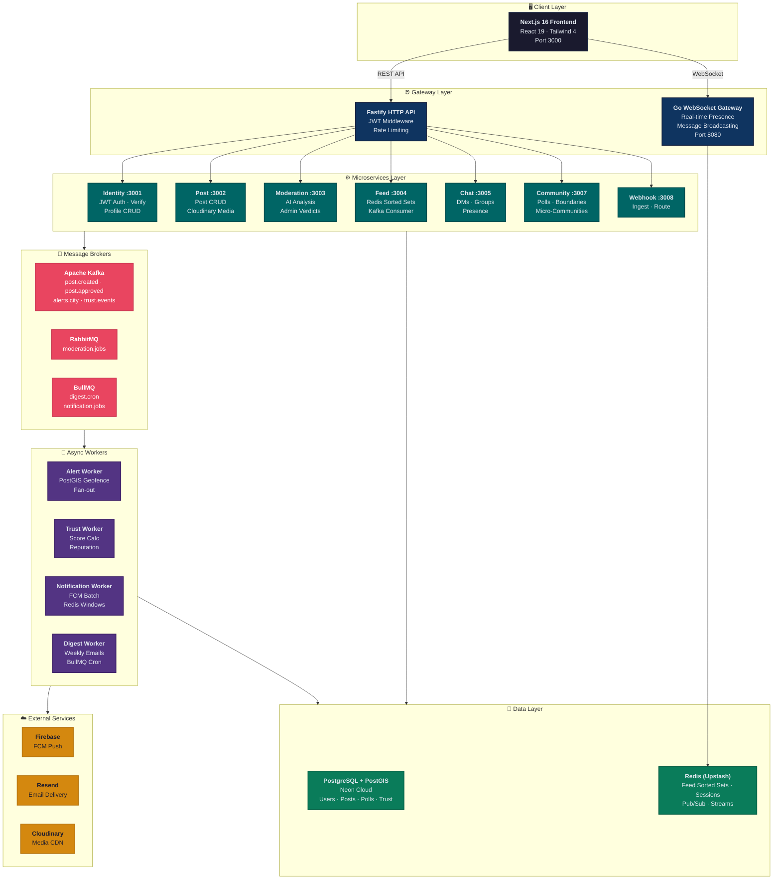
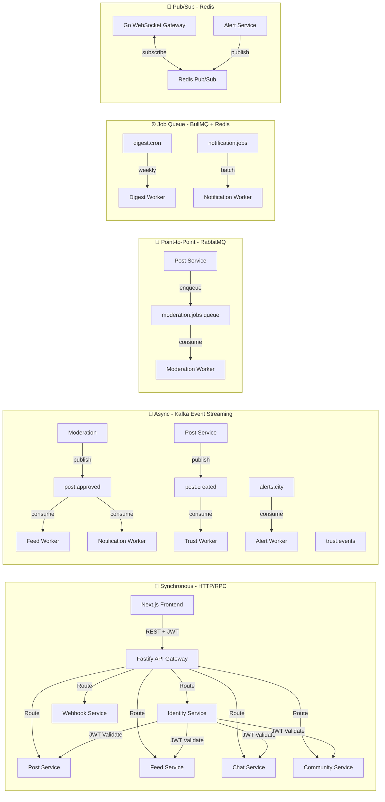
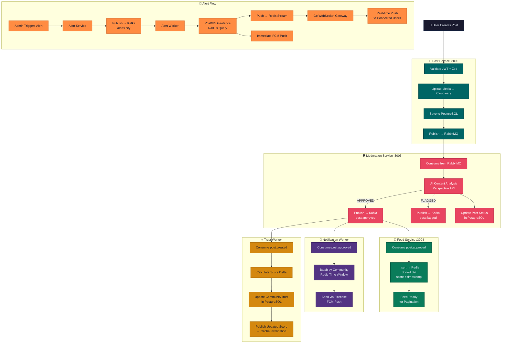
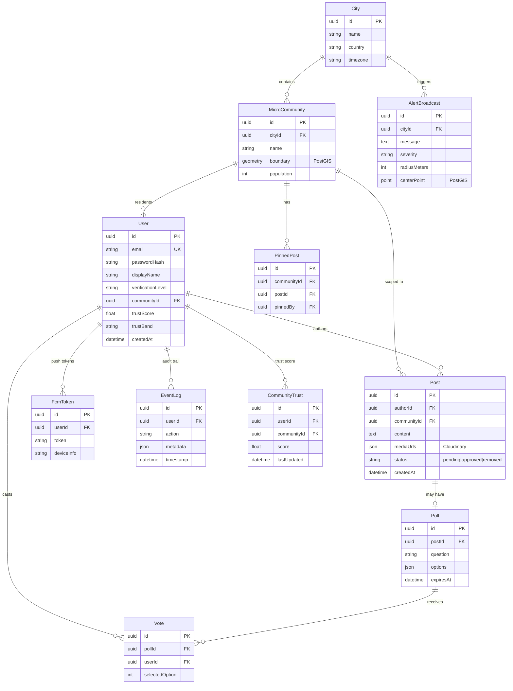

# NeighBr

<p align="center">
  =18" />
  
  
  
</p>

**NeighBr** is a hyperlocal neighbourhood platform built on verified residency. It delivers real-time alerts, contextual community feeds, direct messaging, and trust scoring — all scoped to a user's actual street and community boundaries.

---

## ✨ Key Features

| Feature                     | Description                                                                                      |
| --------------------------- | ------------------------------------------------------------------------------------------------ |
| **Verified Residents Only** | JWT-authenticated identities backed by a trusted verification pipeline                           |
| **Geofenced Alerts**        | Emergency / geo-gated broadcasts delivered via geospatial PostGIS queries                        |
| **Batched Feed**            | Nomadic subscriber workers aggregate posts into per-community windows and push updates via Kafka |
| **Real-Time Messaging**     | Live DMs and group chats served over the Go WebSocket Gateway                                    |
| **Trust Scoring**           | Asynchronous trust pipeline updates user reputation scores from community actions                |
| **Weekly Digests**          | BullMQ-scheduled cron tasks compose and dispatch HTML email summaries via Resend                 |
| **Push Notifications**      | Firebase Cloud Messaging (FCM) broadcasts batched through Redis for delivery windows             |

---

## 🏗 System Architecture

### High-Level Architecture




### Backend Architecture Deep Dive

#### Service Communication Patterns



**1. Synchronous HTTP/RPC**
- **Identity → All Services**: JWT token validation via shared middleware
- **Frontend → API Gateway**: RESTful API calls with Fastify
- **Service → Service**: Direct HTTP calls for non-critical operations

**2. Asynchronous Event Streaming (Kafka)**
- **Post → Feed**: `post.created` event triggers feed sorted-set insertion
- **Post → Notification**: `post.created` event triggers notification batching
- **Post → Trust**: `post.created` event triggers trust score calculation
- **Alert → WebSocket**: `alerts.{city}` topic triggers real-time push
- **Moderation → Feed**: `post.approved`/`post.removed` events update feed state

**3. Point-to-Point Messaging (RabbitMQ)**
- **Post → Moderation**: New posts queued for AI analysis
- **Moderation → Post**: Approval/rejection results returned

**4. Job Queues (BullMQ + Redis)**
- **Digest Worker**: Scheduled weekly cron jobs for email digests
- **Notification Worker**: Batching FCM pushes within time windows

**5. Pub/Sub (Redis)**
- **WebSocket Gateway**: Real-time presence updates
- **Alert Service**: Community-specific alert streams

#### Data Flow Patterns



#### Scalability Design

**Horizontal Scaling**
- **Stateless Services**: Identity, Post, Feed, Chat, Community, Webhook can scale horizontally
- **Worker Services**: Alert, Trust, Notification, Digest scale via consumer group configuration
- **Database**: PostgreSQL connection pooling + read replicas (Neon handles this)
- **Redis**: Cluster mode for high availability (Upstash handles this)

**Vertical Scaling**
- **WebSocket Gateway**: Go-based for high concurrency (100k+ connections)
- **Feed Service**: Redis sorted-sets for O(log N) feed operations
- **Alert Service**: PostGIS spatial indexes for fast geospatial queries

**Caching Strategy**
- **Feed**: Redis sorted-sets with TTL (per-community caching)
- **User Sessions**: Redis with 24-hour expiration
- **API Responses**: Fastify in-memory cache for frequently accessed data
- **Static Assets**: Cloudinary CDN for media delivery

---

## 🔧 Technology Stack

### Core Infrastructure

| Technology | Purpose | Version |
|------------|---------|---------|
| **Fastify** | High-performance HTTP framework | ^5.8.5 |
| **PostgreSQL + PostGIS** | Relational database with geospatial querying | Neon Cloud |
| **Prisma ORM** | Type-safe database access layer | ^7.8.0 |
| **Redis (Upstash)** | Pub/Sub, presence, sorted-set feed ordering, alert streams | ^5.10.1 |
| **BullMQ** | Scheduled / recurring background jobs | Latest |
| **RabbitMQ (CloudAMQP)** | Point-to-point moderation queue | ^2.0.1 |
| **Kafka** | Event log across services (alerts, trust, notifications) | ^2.2.4 |
| **Firebase Admin SDK** | FCM push notification delivery | Latest |
| **Resend** | Transactional and digest email mailer | Latest |
| **Cloudinary** | Media storage and CDN delivery | ^2.10.0 |
| **Turborepo** | Monorepo orchestration (build / dev / lint / type-check) | ^2.9.14 |
| **TypeScript** | Strict type safety across all services | ^5.9.2 |
| **Zod** | Runtime input validation | ^4.4.3 |
| **bcrypt** | Password hashing | ^6.0.0 |

### Frontend Stack

| Technology | Purpose | Version |
|------------|---------|---------|
| **Next.js** | React framework with App Router | 16 |
| **React** | UI library | 19 |
| **Tailwind CSS** | Utility-first styling | 4 |
| **Lucide React** | Icon library | Latest |

### Development Tools

| Technology | Purpose |
|------------|---------|
| **ESLint** | Linting with shared config |
| **Prettier** | Code formatting |
| **ts-node** | TypeScript execution |
| **Prisma Studio** | Database GUI |

---

## 📦 Repository Layout

```
neighbr/
├── apps/
│   ├── web/                          → Next.js frontend (port 3000)
│   │   ├── app/                      → React App Router pages
│   │   ├── components/               → React components
│   │   └── lib/                      → Utilities and helpers
│   │
│   ├── services/
│   │   ├── identity/                 → Auth, verification, user profiles   (port 3001)
│   │   │   ├── src/
│   │   │   │   ├── routes/           → Fastify route handlers
│   │   │   │   ├── plugins/          → Fastify plugins (JWT, Redis, Kafka)
│   │   │   │   └── middleware/       → Custom middleware
│   │   │   └── .env.example          → Environment variables template
│   │   │
│   │   ├── post/                     → Content creation, moderation ingress  (port 3002)
│   │   │   ├── src/
│   │   │   │   ├── routes/           → Post CRUD endpoints
│   │   │   │   └── plugins/          → RabbitMQ producer
│   │   │   └── .env.example
│   │   │
│   │   ├── moderation/               → AI moderation worker + admin API     (port 3003)
│   │   │   ├── src/
│   │   │   │   ├── routes/           → Admin verdict API
│   │   │   │   ├── workers/          → RabbitMQ consumer
│   │   │   │   └── ai/               → Content analysis logic
│   │   │   └── .env.example
│   │   │
│   │   ├── feed/                     → Feed reads · Kafka consumer          (port 3004)
│   │   │   ├── src/
│   │   │   │   ├── routes/           → Feed pagination endpoints
│   │   │   │   ├── consumers/        → Kafka event consumers
│   │   │   │   └── cache/            → Redis sorted-set operations
│   │   │   └── .env.example
│   │   │
│   │   ├── chat/                     → Direct & group messaging             (port 3005)
│   │   │   ├── src/
│   │   │   │   ├── routes/           → Chat API endpoints
│   │   │   │   └── presence/         → User presence tracking
│   │   │   └── .env.example
│   │   │
│   │   ├── webhook/                  → Incoming webhook endpoint            (port 3008)
│   │   │   ├── src/
│   │   │   │   └── routes/           → Webhook handlers
│   │   │   └── .env.example
│   │   │
│   │   ├── community/                → Micro-communities & polls            (port 3007)
│   │   │   ├── src/
│   │   │   │   ├── routes/           → Community & poll endpoints
│   │   │   │   └── geospatial/       → PostGIS boundary operations
│   │   │   └── .env.example
│   │   │
│   │   ├── notification/             → FCM push · batching · Redis windows  (worker)
│   │   │   ├── src/
│   │   │   │   ├── consumers/        → Kafka event consumers
│   │   │   │   ├── batching/         → Time window batching logic
│   │   │   │   └── fcm/              → Firebase integration
│   │   │   └── .env.example
│   │   │
│   │   ├── alert/                    → Geofenced alert fan-out worker       (worker)
│   │   │   ├── src/
│   │   │   │   ├── consumers/        → Kafka alert consumers
│   │   │   │   ├── geospatial/       → PostGIS geofence queries
│   │   │   │   └── fanout/           → Multi-channel alert distribution
│   │   │   └── .env.example
│   │   │
│   │   ├── trust/                    → Trust-score computation worker       (worker)
│   │   │   ├── src/
│   │   │   │   ├── consumers/        → Kafka trust event consumers
│   │   │   │   ├── scoring/          → Trust score calculation algorithms
│   │   │   │   └── reputation/       → Reputation management logic
│   │   │   └── .env.example
│   │   │
│   │   └── digest/                   → Weekly email digest worker           (worker)
│   │       ├── src/
│   │       │   ├── jobs/             → BullMQ cron job definitions
│   │       │   ├── templates/        → Email HTML templates
│   │       │   └── resend/           → Resend API integration
│   │       └── .env.example
│   │
│   └── deploy/
│       ├── api/                      → Production API deployment bundle
│       │   ├── package.json
│       │   └── .env.example
│       └── workers/                  → Production workers deployment bundle
│           ├── package.json
│           └── .env.example
│
├── packages/
│   ├── db/                           → Prisma schema · generated client
│   │   ├── prisma/
│   │   │   ├── schema.prisma        → Database schema definition
│   │   │   └── seed.ts              → Database seeding script
│   │   └── scripts/
│   │       └── build.mjs            → Prisma client build script
│   │
│   ├── config/                       → Shared environment / config types
│   │   ├── index.ts                 → Config validation
│   │   └── env.ts                   → Environment variable schemas
│   │
│   ├── ui/                           → Shared React component library
│   │   ├── components/               → Reusable UI components
│   │   └── styles/                  → Shared styles
│   │
│   ├── eslint-config/                → Shared ESLint configuration
│   │   ├── index.js                 → Base ESLint config
│   │   └── next.js                  → Next.js specific rules
│   │
│   └── typescript-config/            → Shared tsconfig presets
│       ├── base.json                → Base TypeScript config
│       ├── nextjs.json              → Next.js specific config
│       └── react-library.json       → React library config
│
├── package.json                      → Root workspace manifest
├── turbo.json                        → Turborepo pipeline config
├── render.yaml                       → Render deployment configuration
├── .gitignore                        → Git ignore rules
├── .node-version                     → Required Node.js version
├── .npmrc                            → npm configuration
└── README.md                         → This file
```

---

## 🗄 Database Schema (Prisma)

### Core Models

| Model | Description | Key Fields |
|-------|-------------|------------|
| `City` | Top-level geographic container | `id`, `name`, `country`, `timezone` |
| `MicroCommunity` | A named street / block within a city (PostGIS geometry boundary) | `id`, `cityId`, `name`, `boundary` (PostGIS), `population` |
| `User` | Resident profile — JWT identity, verification status, notification settings | `id`, `email`, `passwordHash`, `isVerified`, `communityId`, `trustScore` |
| `Post` | A feed item authored by a user within a micro-community | `id`, `authorId`, `communityId`, `content`, `mediaUrls`, `createdAt` |
| `Poll` | Community surveys created by members | `id`, `postId`, `question`, `options`, `expiresAt` |
| `Vote` | Individual poll response | `id`, `pollId`, `userId`, `selectedOption` |
| `FcmToken` | Push-notification device tokens per user | `id`, `userId`, `token`, `deviceInfo` |
| `PinnedPost` | Block-captain sticky posts per micro-community | `id`, `communityId`, `postId`, `pinnedBy` |
| `EventLog` | Audit log for all important actions | `id`, `userId`, `action`, `metadata`, `timestamp` |
| `AlertBroadcast` | Geofenced emergency alert records | `id`, `cityId`, `message`, `severity`, `radiusMeters`, `centerPoint` |
| `CommunityTrust` | Per-community trust metric for each user | `id`, `userId`, `communityId`, `score`, `lastUpdated` |

### Relationships



---

## 🚀 Getting Started

### Prerequisites

- **Node.js** `>= 18` (install via [nvm](https://github.com/nvm-sh/nvm) or [fnm](https://github.com/Schniz/fnm))
- **npm** `10.8.2` (use the root `.npmrc` version)
- **PostgreSQL** — local instance or [Neon](https://neon.tech) connection string
- **Redis** — local instance or [Upstash](https://upstash.com)
- **Kafka** broker — local [confluent platform](https://www.confluent.io/) or [Redpanda](https://redpanda.com/)
- **RabbitMQ** broker — local or [CloudAMQP](https://www.cloudamqp.com/) (for moderation queue only)
- **Google Cloud** — service account key for FCM (notification service only)
- **Resend API Key** — for email delivery (digest & verification)

### Installation

```bash
# 1. Clone the repository
git clone https://github.com/khushal-winner/neighbr.git
cd neighbr

# 2. Install all workspace dependencies
npm install

# 3. Generate the Prisma client from the shared schema
cd packages/db && npx prisma generate

# 4. Push schema changes to your database
cd packages/db && npx prisma migrate dev

# 5. (Optional) Seed database with sample data
cd packages/db && npx prisma db seed

# 6. (Optional) Open Prisma Studio for database inspection
cd packages/db && npx prisma studio
```

### Environment Variables

Each service exposes a `.env.example` file. Copy it to `.env` in the same directory and fill in the required secrets.

#### Shared Variables (Used Across Most Services)

| Variable | Required | Used By | Purpose |
|----------|----------|---------|---------|
| `DATABASE_URL` | ✅ | All DB-backed services | Neon PostgreSQL connection string |
| `REDIS_URL` | ✅ | Feed, Notification, Trust, Identity | Redis connection string |
| `KAFKA_BROKER` | ✅ | Feed, Alert, Notification, Trust, Post | Kafka bootstrap server |
| `JWT_SECRET` | ✅ | Identity, Post, Feed, Chat, Community | JWT signing secret (min 32 chars) |
| `COOKIE_SECRET` | ✅ | Identity | Cookie encryption secret (min 32 chars) |
| `NODE_ENV` | ✅ | All | Runtime environment (`development` or `production`) |
| `FRONTEND_URL` | ✅ | Identity, Post, Chat | Frontend URL for CORS |
| `INTERNAL_SECRET` | ✅ | All services | Internal service communication secret |

#### Service-Specific Variables

**Identity Service**
| Variable | Required | Purpose |
|----------|----------|---------|
| `RESEND_API_KEY` | ✅ | Resend API key for verification emails |
| `EMAIL_FROM` | ✅ | Sender email address for verification emails |

**Post Service**
| Variable | Required | Purpose |
|----------|----------|---------|
| `RABBITMQ_URL` | ✅ | RabbitMQ connection string for moderation queue |
| `CLOUDINARY_CLOUD_NAME` | ✅ | Cloudinary cloud name |
| `CLOUDINARY_API_KEY` | ✅ | Cloudinary API key |
| `CLOUDINARY_API_SECRET` | ✅ | Cloudinary API secret |

**Moderation Service**
| Variable | Required | Purpose |
|----------|----------|---------|
| `RABBITMQ_URL` | ✅ | RabbitMQ connection string |
| `PERSPECTIVE_API_KEY` | ❌ | Google Perspective API key for content analysis |

**Notification Service**
| Variable | Required | Purpose |
|----------|----------|---------|
| `FIREBASE_SERVICE_ACCOUNT_PATH` | ✅ | Path to Firebase service account JSON |
| `NOTIFICATION_WINDOW_MS` | ❌ | Batching time window in milliseconds (default: 3600000) |

**Digest Service**
| Variable | Required | Purpose |
|----------|----------|---------|
| `RESEND_API_KEY` | ✅ | Resend API key for digest emails |
| `DIGEST_FROM_EMAIL` | ✅ | Sender email for digests |
| `DIGEST_CRON` | ❌ | Cron schedule for weekly digests (default: `0 6 * * 0`) |

**Alert Service**
| Variable | Required | Purpose |
|----------|----------|---------|
| `RADIUS_METERS` | ❌ | Default alert radius in meters (default: 500) |

> **Tip:** Start with the Identity service first — it does not depend on Kafka or RabbitMQ — then add external services one at a time to confirm connectivity.

### Running Locally

#### Development Mode (All Services)

```bash
# Start all services and the web app via Turborepo (parallelised)
turbo run dev
```

#### Individual Services

```bash
# HTTP Services
cd apps/services/identity && npm run dev     # Identity  — port 3001
cd apps/services/post     && npm run dev     # Post      — port 3002
cd apps/services/moderation && npm run dev   # Moderation — port 3003
cd apps/services/feed      && npm run dev     # Feed      — port 3004
cd apps/services/chat      && npm run dev     # Chat      — port 3005
cd apps/services/webhook   && npm run dev     # Webhook   — port 3008
cd apps/services/community && npm run dev     # Community — port 3007

# Worker Services
cd apps/services/notification && npm run dev  # Notification worker
cd apps/services/alert     && npm run dev     # Alert worker
cd apps/services/trust     && npm run dev     # Trust worker
cd apps/services/digest    && npm run dev     # Digest worker

# Frontend
cd apps/web                && npm run dev     # Next.js frontend — port 3000
```

#### Production Build

```bash
# Build all packages and services in topological dependency order
turbo run build

# Build specific deployment bundles
npm run build:deploy-api      # API services bundle
npm run build:deploy-workers  # Worker services bundle
```

### Code Quality

```bash
# Lint all packages (uses shared eslint-config)
turbo run lint

# Type-check all packages (uses shared typescript-config)
turbo run check-types

# Format code with Prettier
npm run format
```

---

## 📡 Event Flow


---

## 🗺 Service Reference

### HTTP Services

| Service | Port | Dependencies | Endpoints | Description |
|---------|------|--------------|-----------|-------------|
| `@neighbr/identity` | 3001 | PostgreSQL, Redis, Resend | `/auth/*`, `/verification/*`, `/users/*` | JWT auth, resident verification, user profile CRUD |
| `@neighbr/post` | 3002 | PostgreSQL, RabbitMQ, Kafka, Cloudinary | `/posts/*`, `/media/*` | Post CRUD, moderation routing to RabbitMQ |
| `@neighbr/moderation` | 3003 | PostgreSQL, RabbitMQ, Kafka | `/moderation/*` | AI content analysis via RabbitMQ consumer; admin verdict API |
| `@neighbr/feed` | 3004 | PostgreSQL, Redis, Kafka | `/feed/*` | Feed reads through Redis sorted-sets; Kafka consumer for post events |
| `@neighbr/chat` | 3005 | PostgreSQL, Redis | `/chats/*`, `/messages/*` | Direct messages, group chat rooms, presence |
| `@neighbr/webhook` | 3008 | PostgreSQL | `/webhooks/*` | Incoming webhook endpoint |
| `@neighbr/community` | 3007 | PostgreSQL, Kafka | `/communities/*`, `/polls/*` | Micro-community CRUD, community polls |

### Worker Services

| Service | Dependencies | Kafka Topics | Description |
|---------|--------------|--------------|-------------|
| `@neighbr/notification` | Redis, Kafka, Firebase | `post.created`, `alerts.*` | Firebase FCM push, batched per community through configurable time window |
| `@neighbr/alert` | PostgreSQL, Redis, Kafka | `alerts.*` | PostGIS radius-based emergency alert fan-out per user |
| `@neighbr/trust` | PostgreSQL, Kafka | `post.created`, `post.removed`, `trust.events` | Async trust-score updates from Kafka events |
| `@neighbr/digest` | PostgreSQL, Resend, BullMQ | — | BullMQ weekly digest jobs; HTML render + Resend delivery |

### Frontend

| Service | Port | Technology | Description |
|---------|------|------------|-------------|
| **web** | 3000 | Next.js 16, React 19, Tailwind CSS 4 | React App Router, server components, client components |

---

## 🚢 Deployment

### Production Deployment (Render + Vercel)

#### Backend Deployment (Render)

**API Services Bundle**
```bash
# Build the API deployment bundle
npm run build:deploy-api

# Deploy to Render
cd apps/deploy/api
# Follow Render deployment instructions
```

**Workers Bundle**
```bash
# Build the workers deployment bundle
npm run build:deploy-workers

# Deploy to Render
cd apps/deploy/workers
# Follow Render deployment instructions
```

**Required Environment Variables on Render**

See `apps/deploy/api/.env.example` and `apps/deploy/workers/.env.example` for the complete list.

#### Frontend Deployment (Vercel)

```bash
# Deploy to Vercel
cd apps/web
vercel
```

**Required Environment Variables on Vercel**

- `NEXT_PUBLIC_API_URL` — Production API URL
- `NEXT_PUBLIC_WS_URL` — Production WebSocket Gateway URL

### Infrastructure Requirements

| Service | Provider | Minimum Plan |
|---------|----------|--------------|
| PostgreSQL | Neon | Free tier |
| Redis | Upstash | Free tier |
| Kafka | Redpanda Cloud | Free tier |
| RabbitMQ | CloudAMQP | Little Lemur tier |
| API Services | Render | Free tier |
| Workers | Render | Free tier |
| Frontend | Vercel | Hobby tier |

---

## 🔒 Security Considerations

### Authentication & Authorization

- **JWT Tokens**: Short-lived access tokens (15min) + refresh tokens (7 days)
- **Password Hashing**: bcrypt with cost factor 10
- **API Key Management**: Environment variables only, never committed
- **CORS**: Configured per service with allowed origins
- **Rate Limiting**: Implemented on critical endpoints

### Data Protection

- **Encryption**: TLS 1.3 for all external communications
- **PII**: User emails and personal data stored securely
- **Media**: Uploaded to Cloudinary with transformation rules
- **Audit Logging**: All critical actions logged to EventLog table

### Network Security

- **Internal Communication**: Services communicate via `INTERNAL_SECRET`
- **Database Access**: Connection pooling + SSL required
- **Message Brokers**: SASL authentication for Kafka, AMQP for RabbitMQ

---

## 📄 License

MIT — see [LICENSE](LICENSE) for details.

---

## 🤝 Contributing

Contributions are welcome! Please read our contributing guidelines before submitting PRs.

---

## 📞 Support

For questions or issues, please open a GitHub issue or contact the maintainers.
